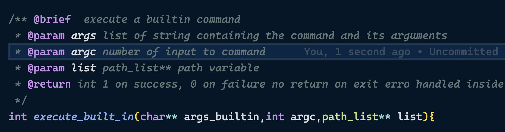

# Report of Comp3300 Ass

## Overview 

In this assignment, I implemented the Anubis programmes
which is an interactive command line program that supports various features that are in a regular Linux terminal/bash. 

This report will briefly mention some details about the programme's implementation.

## Featurese 

### built-in command: path

Usage: path \<serachfolder> | ...

The path command takes multiple input and sets the search path(where anubis look for executable fields) to the input.

### built-in command: cd
Usage: cd \<directory>

Change the working directory of the programme.

### built-in command: exit
Usage: exit the anubis programme

### Batch mode 
The program can accept a file containing lines of instruction and execute the commands line by line inside the file 

### Parallelism 

The anubis offers options to the user to run the commands in parallel using the special symbol "&". 

**cmd1 args1 & cmd2 args2** will allow cmd1 and cmd2 to be executed in parallel(there is no guranteen that cmd2 is going to be executed after cmd1 but due to operation in praparing starting of processes cmd2 is likey to start after cmd1)

### Pipes

The anubis programme allows the user to redirect the stdout of a program to the stdin of another program using **"|"**. For example, **"ls | wc"** would show the word count of the ls command output.

The number of programs that the usr could chain up does not have a limit. Users could chain up multiple programs using pipe symbols.

### Output Redirection

Usage: [programme] \> [target file]

The anubis program allows the user to redirect the stdout of programs to a 
file in the file system. If the target file is not found, anubis will create the corresponding file. 

### Precedence of execution 
A line of command in anubis would follow the following grammar of precedence.

command_exp := name_of_bin and arguments

redir_exp := pipe_exp | pipe_exp > file_name

pipe_exp := command_exp / command_exp | pipe_exp

parallel_exp := redir_exp | redir_exp & parallel_exp

## Implementation details & documentation
### Anubis.c 

Anubis.c contains the programme's main function and is responsible for *setup initial data structures*, *reading user input*, and *calling the corresponding function* to process the user input.

#### Data structures

It initialises the path_list and sets the stdin of the anubis program. This set of input_file allows the anubis to read commands from a file and run in batch mode.

#### Command line/File input

As shown above, the anubis program uses a 'getline()' inside the while loop to consume all the input in the stdin or input file. The program exits when there are *no more lines to read, receiving an empty string or EOF symbol*

#### Built-in Command Execution 

After reading the input line, the anubis program will check for built-in commands and attempt to execute them. (Consider not using the same name as the built-in command as file name/programme name as that would confuse the program.)

After successfully finding the built-in command in the input's first place,  commands will be executed with *execute_built_in* function. The documentation of the *execute_built_in* is as follows(errors will be handled inside the function).

#### Tokenising

After checking for built-in commands, the anubis program will view the input as a line of command that needs to be processed. The first step is tokenising the input string.

For further details about tokenising, please check tokerniser.c

#### Parsing 

After the call to tokenise the string, the main would parse the command into an expression that allows precedence between symbols to be processd

For further details about the parsing process, please check parser.c

### Tokerniser.c

This file contains code related to the tokenisation of commands and strings.

#### Partitioning String

The string pattern is the first step of tokenising the string. The str_partition function divides the string by empty spaces and the special symbols so that they can be tokenised into tokens.
#### Tokenise_str

The tokenise_str utilises the partition string function. Construct *Token* out of the substring and return in *Node*(which is a linked list defined in utils.c)

### Parser.c 
As mentioned, the anubis assumes the incoming command is in the form of the below grammar.

command_exp := name_of_bin and arguments

redir_exp := pipe_exp | pipe_exp > file_name

pipe_exp := command_exp / command_exp | pipe_exp

parallel_exp := redir_exp | redir_exp & parallel_exp

Parser.c contains functions and data structures related to parsing a linked list of tokens. 

In parsing a command, *parse_parallel* is executed on the list of input tokens. It will let *parse_redir* consume tokens until encountering a *"&"*. Parse rider saves the result of parse_redir and, based on the preceding symbole, constructs next *parallel_exp*. 

The *parse_redir* and *parse_pipe* adapt similar structure to the *parse_paraallel*

### process_manager.c

The process_manager contains functions and data structures related to forking and executing expressions.

Similar to the parse, the execution of the command is also in a hierarchical structure. 

Recall that a *parallel_exp* contains a redir_exp or an optional link to the following *parallel_exp*. In executing, the process would call *fork()* for each redir_exp and let the child process call *execute_redirection()* to execute all commands. 

